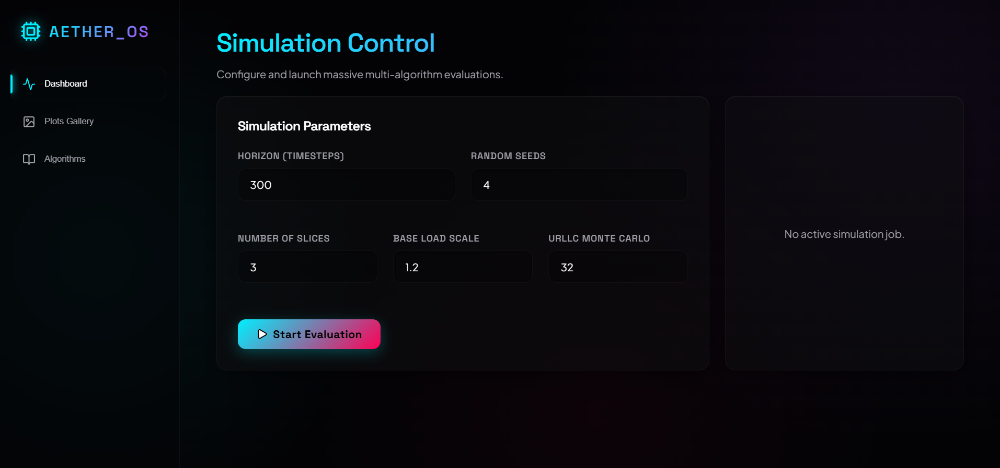
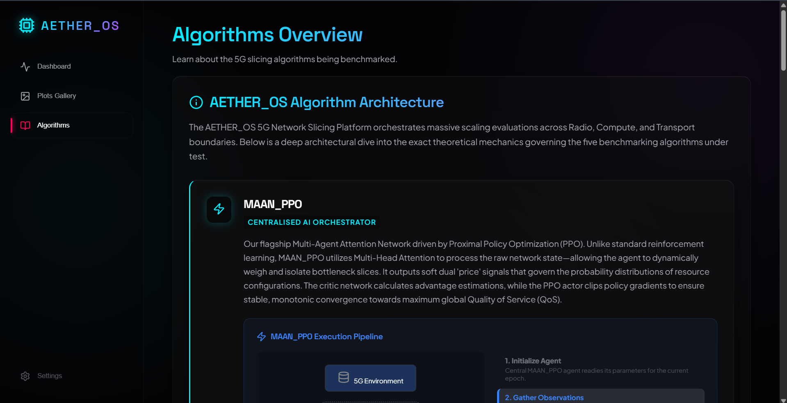

<div align="center">
  
  
  
  <h1>AETHER_OS</h1>
  <p><strong>A Next-Generation 5G Network Slicing & Algorithmic Benchmarking Platform</strong></p>
  <p>Live cinematic 3D dashboard meets heavy mathematical simulation.</p>

</div>

---

### 1. Control Dashboard
Monitor live simulated resources, manage orchestration parameters, and trigger massive multi-seed research evaluations in real-time.



### 2. Result Plot Analysis
Live-generated `matplotlib` benchmarking data rendered directly into a sleek, filterable high-res plot gallery.


### 3. Algorithm Deep-Dives & Visualizations
Understand the exact physical and mathematical mechanics of advanced decentralized networks orchestrators. Features dynamic, step-by-step looping React visualizations for each algorithm (e.g., ADMM Consensus iterations, MAPPO Policy backprop) slowed down across 8 distinct phases so you can actually see the math working in real-time.



### 4. Cinematic 3D Interactions
A fully reactive zero-gravity glassmorphism environment. Uses refined CSS transitions, glowing neon multi-head attention particles, and smooth layout staggering to make deep mathematical benchmarking feel like a premium Awwwards-quality product.

---

## Architecture & Under the Hood

The repository is split into two isolated applications that communicate over a local REST API:

```text
5G--project/
├── backend/          ← Python mathematical engine (PyTorch, SciPy, FastAPI)
└── frontend/         ← React + Vite visual UI (Lucide, Tailwind, Glassmorphism)
```

### The 5 Algorithms Benchmarked
Aether_OS runs statistical benchmarks to evaluate how well different logics orchestrate **eMBB**, **URLLC**, and **mMTC** slices under heavy network load collisions:
1. **MAAN_PPO** (Cyan): Multi-Agent Attention Network utilizing PPO to analyze bottleneck states.
2. **C_ADMM** (Green): Consensus ADMM applying decentralized Augmented Lagrangian optimization.
3. **Ind. MAPPO_PPO** (Red): Independent PPO agents attempting blind orchestration (Fail baseline).
4. **OMD Bandit** (Orange): Online Mirror Descent using physical environment cost perturbations.
5. **Static Greedy** (Purple): Heuristic SLA-priority routing. Purely deterministic.

---

## Environment Setup & Download

You will need the following installed on your machine to run Aether_OS locally:
- **[Python 3.10+](https://www.python.org/downloads/)**
- **[Node.js (LTS Version 18+)](https://nodejs.org/)**

### Step 1: Download the Repository
Clone this directory to your machine or download the ZIP from GitHub and extract it.

### Step 2: Backend Setup
Open **Terminal 1** and navigate into the backend folder to boot the Python physics engine.

```powershell
cd 5G--project/backend

# Create a secluded virtual environment (First time only)
python -m venv .venv

# Activate the environment (Do this every time you open a terminal)
.\.venv\Scripts\Activate.ps1

# Install heavy dependencies (PyTorch, Pandas, FastAPI)
pip install -r requirements.txt

# Start the simulation API
python main.py
```
*The API will start running at `http://127.0.0.1:8000`. Keep this terminal open.*

### Step 3: Frontend Setup
Open **Terminal 2** and navigate into the frontend folder to boot the React visuals.

```powershell
cd 5G--project/frontend

# Install JavaScript UI dependencies (First time only)
npm install

# Start the cinematic dashboard
npm run dev
```
*The App will start running at `http://localhost:5173`.*

---

## How to use the Simulation

1. Open **`http://localhost:5173`** in your browser.
2. In the "Dashboard" tab, adjust the **Traffic Load** slider to test network stress.
3. Click the glowing **Run Full Research** button in the dashboard.
4. Watch the progress bar as the Python backend calculates millions of node paths in real-time.
5. Once complete, navigate to the **Plot Gallery** to dynamically view the resultant CSV/PNG charts.

---
<div align="center">
  <p><em>Built with Awwwards-Quality aesthetics and rigorous mathematical orchestration frameworks.</em></p>
</div>
